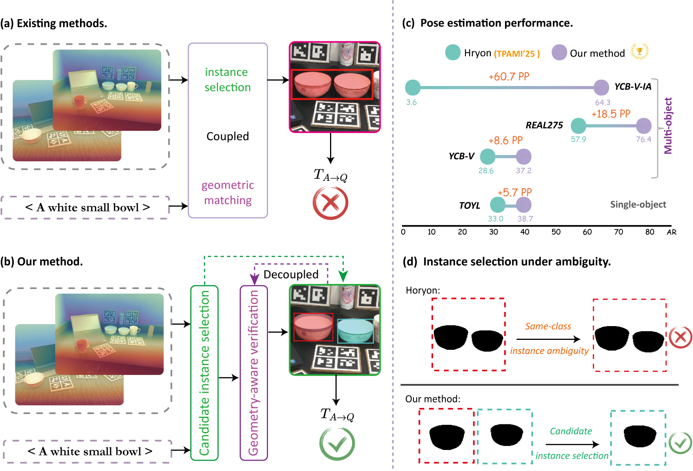
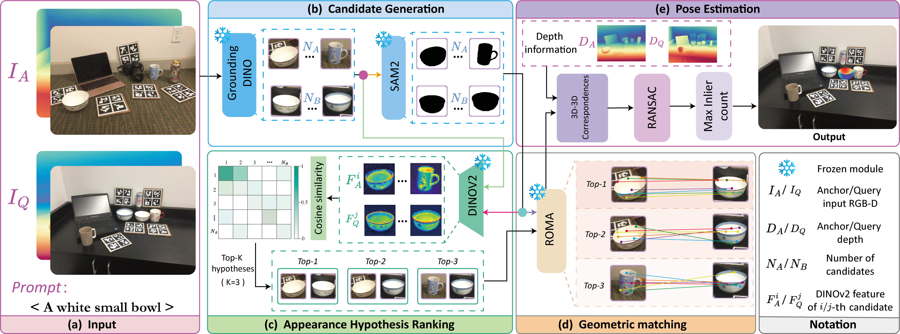

# TFIDPose

<div align="center">

<h2>Training-Free Instance Disambiguation for Open-Vocabulary Relative 6D Pose Estimation</h2>

<p>
  <strong>Chunlong Yang</strong>
</p>

<p>
  Ph.D. Student &nbsp;|&nbsp; 3D Computer Vision &nbsp;|&nbsp; 6D Pose Estimation &nbsp;|&nbsp; Embodied AI
</p>

<p>
  <a href="https://github.com/YangLeonbjtu">
    
  </a>
  <a href="https://scholar.google.com/citations?user=EqFOt3kAAAAJ">
    
  </a>
  <a href="#">
    
  </a>
  <a href="#">
    
  </a>
</p>

</div>

---

## 🔥 Overview

<div align="center">
  
</div>

**TFIDPose** is a training-free framework for **open-vocabulary relative 6D pose estimation**.

Given an anchor RGB-D image, a query RGB-D image, and a text prompt, TFIDPose estimates the relative 6D pose of the target object across different scenes. The key challenge is **cross-image same-category instance ambiguity**. When multiple visually similar objects appear in the query scene, existing methods may select the wrong instance and produce an incorrect pose.

TFIDPose addresses this problem with a simple **hypothesis-then-verify** pipeline. It first proposes candidate object pairs, ranks them by instance-aware appearance similarity, and then selects the correct pair through geometry-aware verification.

---

## ✨ Highlights

* **Training-free**: no task-specific fine-tuning is required.
* **Open-vocabulary**: target objects are specified by text prompts.
* **Instance-disambiguated**: robust to same-category multi-instance ambiguity.
* **Geometry-aware**: final selection is based on 3D geometric consistency.

---

## 🧠 Method

<div align="center">
  
</div>

TFIDPose explicitly decouples **instance selection** from **geometric correspondence**.

### 1. Candidate Generation

We use **GroundingDINO** to detect text-specified candidate objects and **SAM2** to obtain instance masks.

### 2. Appearance Hypothesis Ranking

For each candidate instance, we extract mask-pooled **DINOv2** descriptors. Candidate pairs are ranked by cosine similarity, and the top-K hypotheses are retained.

### 3. Geometric Matching

For each hypothesis, **RoMa** generates dense correspondences. We then filter correspondences using instance masks and back-project valid matches into 3D.

### 4. Pose Estimation

We estimate the relative pose with **RANSAC** and select the hypothesis with the largest geometric support.

---

## 🖼️ Qualitative Preview

TFIDPose is designed to select the correct target instance from multiple same-category candidates and recover a geometrically consistent relative 6D pose.

<div align="center">
  
</div>

---

## 🛠️ Installation

The code will be released soon.

```bash
git clone https://github.com/YangLeonbjtu/TFIDPose.git
cd TFIDPose
```

---

## 🚀 Usage

A demo script will be provided after code release.

```bash
python demo.py \
  --anchor path/to/anchor_rgbd \
  --query path/to/query_rgbd \
  --prompt "a white small bowl"
```

---

## 📁 Repository Structure

```text
TFIDPose/
├── assets/
│   ├── teaser.png
│   └── pipeline.png
├── README.md
└── code coming soon
```

---

## 📚 Citation

If you find this project useful, please consider citing our work.

```bibtex
@article{yang2026tfidpose,
  title   = {TFIDPose: Training-Free Instance Disambiguation for Open-Vocabulary Relative 6D Pose Estimation},
  author  = {Yang, Chunlong},
  journal = {arXiv preprint},
  year    = {2026}
}
```

---

## 📬 Contact

For questions, please contact:

**Chunlong Yang**
GitHub: [YangLeonbjtu](https://github.com/YangLeonbjtu)
Google Scholar: [EqFOt3kAAAAJ](https://scholar.google.com/citations?user=EqFOt3kAAAAJ)

---
